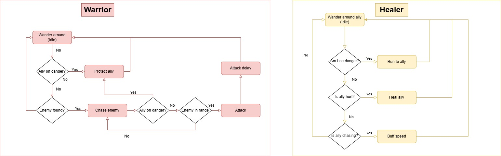
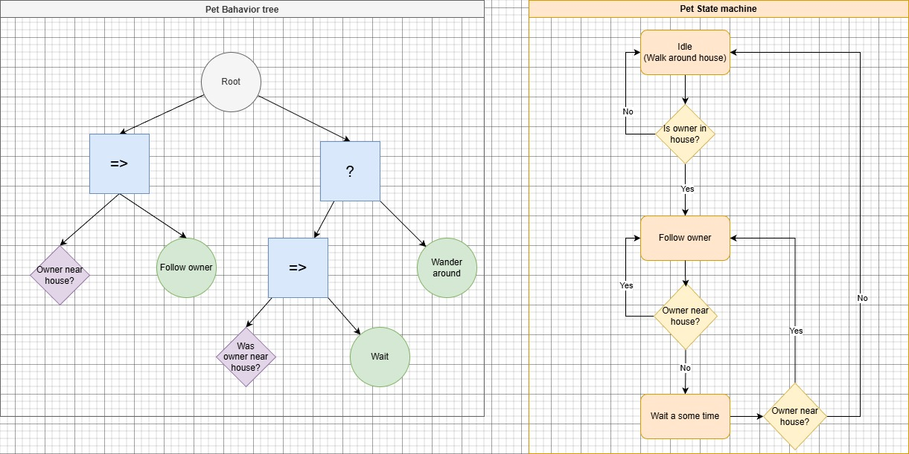

# IA Arboles de decisiones 
Juan Haro

## Parcial 1: *Mejora IA SPA*

### Planteamiento de la IA

Crear la IA para un NPC el cual ayude al jugador, ya sea eliminando enemigos, curando al jugador e incluso dándole munición cuando la necesite.

## Ejecucion 

En el archivo [SPA_Sheva.cs](Assets/_Parcial_1/Scripts/SPA_Sheva.cs) podemos encontrar la IA la cual realiza el proceso anterior. 

Esta IA cuenta con multiples ***sentidos*** los cuales son: 
* Percepción de la posición del jugador: En teoría al ser un aliado siempre debería de poder saber donde este se encuentra.
* Percepción de la vida del jugador: Misma lógica, es su aliado y puede saber si esta bien o necesita ayuda.
* Percepción de las balas del jugador: A este punto se entiende la idea.
* Percepción de sus propias estadísticas: Vida, balas, y cantidad de curaciones.
* Vista: Puede percibir enemigos en un cierto FOV, basado en un angulo de vision y en una distancia maxima.

En base a esto valora su situación y ***planea*** que acción puede ejecutar, siendo dichas acciones:
* Curar al jugador: En base a su porcentaje de vida y la cantidad de curas disponibles disponibles.
* Autocuración: Dependiendo de su porcentaje de vida y curas disponibles.
* Dar balas: Dará balas al jugador en base de cuantas le falten del máximo (50) y si el jugador tiene menos balas que la IA.
* Atacar: Si tiene algún enemigo a la vista, pero tomara prioridad de curar antes que de atacar, excepto si el jugador esta atacando a un enemigo que tenga a la vista.
* Vagar: Solo si no hay nada mas que hacer.

Una vez tomada la acción esta se ejecuta hasta que se complete o se tome alguna con mayor prioridad estas ***acciones*** constan de lo siguiente:
* Curar al jugador: Se acerca al jugador y gasta una de sus curas.
* Autocuración: Gasta una de sus curas y se cura.
* Dar balas: Se acerca al jugador y le de parte de su munición.
* Atacar: Busca un enemigo y lo ataca. Le da prioridad primero al ultimo enemigo que ataco, después al objetivo actual del jugador (ultimo objetivo que el jugador ataco) si no puede ver a ninguno de estos, atacara al enemigo mas cercano.
* Vagar: Se moverá alrededor del jugador y lo seguirá a donde vaya.

# Maquinas de estado conectadas

Para conectar ambas maquinas de estado se hizo que ambas tuvieran el blackboard de la otra como variable en su propio blackboard, siendo asi que ahora ambas pueden revisar los estados y variables de la otra para asi poder crear estados mas complejos 

## Guerrero y healer

Para esta actividad, realize una IA de guerrero que se encarga de patrullar, buscar enemigos y atacar a cualquiera que le falte el respeto a su healer.
Mientras que el healer se mueve alrededor del guerrero, le da velocidad cuando esta persiguiendo y lo cura cuando se encuentra en peligro. 

La lógica de cuando cambien sus estados es la siguiente. 

# Parcial 2 *FSM* vs *Behavior tree*: Mascota

## Planteamiento 

Crear una IA (un mascota en este caso) usando una Finite State Machine asi como recrear la misma IA pero usando un Behavior tree.

Esta IA teniendo en cuenta variables como: 
* El radio de la casa (por el cual puede vagar).
* El radio de detección del jugador (En donde lo puede seguir).
* El jugador.
* Cuando fue la ultima vez que vio al jugador cerca.

Con esto puede seguir estados como lo son: 
* Vagar por la casa (Si el jugador no esta cerca).
* Seguir al jugador (Si esta cerca).
* Esperar si el jugador regresa (Si estaba cerca).

Siendo que con estos estados y condiciones, ordenados según el modelo a usar tenemos los siguientes diagramas:

## Ejecución  

La IA realizada en el FSM se puede encontrar en la carpeta [FSM mascota](./Assets/_Parcial_2/ScriptableObjects/Pet_FSM) asi como su registro de variables en el script [PetSFMVariables](Assets/_Parcial_2/Scripts/PetFSMVariables.cs).

Pero se puede resumir en lo siguiente:

### FSM 

Para la FSM se uso la estructura previamente creada asi como los estados modulares mostrados en el diagrama.

Como complicación para esta maquina me encontré con el sincronizar variables de escena, sin embargo con un simple script que guardara las variables de escena y las agregara al blackboard al iniciar la ejecución, facilitando el manejo de variables para esta IA. 
Ademas de se la mas fácil de las 2 al tener mayor experiencia con la estructura.

### BT

Para el BT se empleo la estructura previamente creada asi como las variables y estados marcados en el diagrama.

Como complication de para esta fue la inexperiencia con el sistema, ya que gracias al manejo de un script dedicado a contener todas la variables y uso de lambdas para el manejo de condiciones, facilito el proceso de estructuración del código, eso si como único problema es que una parte de este código no sera tan simple de reutilizar como si es el de la FSM ya que este tiene dependencias o esta directamente creado en dicho script, sin embargo la flexibilidad de modification es bastante conveniente. 

## Analisis final 

Ambas estructuras de IA me parecen utiles para generar comportamientos, sin embargo es inegable que ambas tiene su funionalidad.
A mi criterio, las *FSM* son mejores para IAs con comportamientos mas concretos y controlados, donde las trancisiones son concisas entre estado A,B,C...
Mientras que los *BT* son mejores para IAs con mucho comportamientos y con comportamientos prioritarios, en donde no se importa que este pasando, haya situaciones que obliguen a la IA a cambiar, siendo asi mejor para IAs mas reactivas al ambiente pero mas dificiles de controlar ya que si se tienen muchos estados, es mas difil el predecir en que estado acabara. 

